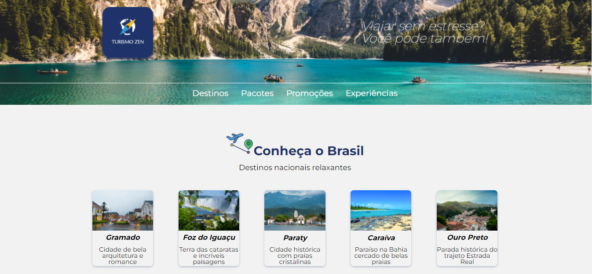

    

## Sobre o projeto

Projeto feito para a primeira semana de desafios do Programa Desenvolve do Grupo Boticário

## Feito com :rocket:

 Utilizado para a estruturação do site
     
     
Utilizado para a estilização da página
     
     
 Utilizado para Prototipação do layout

## Landing page

## Feito por:

    <table>
  <tr>
    <td align="center"><a href="https://github.com/Carlos-Jr1"> <b>Carlos Junior</b></a> </td>
    <td align="center"><a href="https://github.com/Joely-Brito"> <b>Joely Brito</b></a> </td>
    <td align="center"><a href="https://github.com/gutoggg"> <b>Jorge Augusto</b></a> </td>
  </tr>
  <tr>
  <td align="center"><a href="https://github.com/MatheusMuza"> <b>Matheus Muza</b></a> </td>
    <td align="center"><a href="https://github.com/vhdmdls4"> <b>Victor Hugo</b></a> </td>
    <td align="center"><a href="https://github.com/Wanuzia"> <b>Wanuzia Braga</b></a> </td>
  </tr>
</table>

